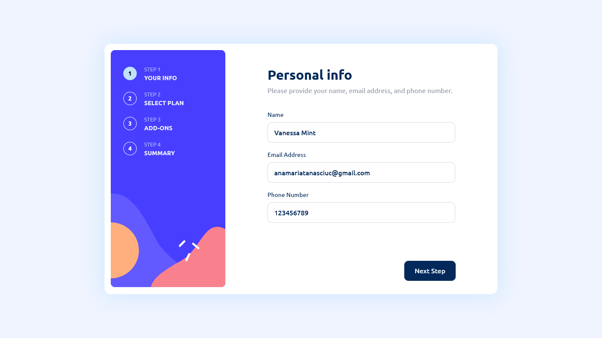

# Frontend Mentor - Multi-step form solution

This is a solution to the [Multi-step form challenge on Frontend Mentor](https://www.frontendmentor.io/challenges/multistep-form-YVAnSdqQBJ). Frontend Mentor challenges help you improve your coding skills by building realistic projects. 

## Table of contents

- [Overview](#overview)
  - [The challenge](#the-challenge)
  - [Screenshot](#screenshot)
  - [Links](#links)
- [My process](#my-process)
  - [What I learned](#what-i-learned)
  - [Continued development](#continued-development)
  - [Useful resources](#useful-resources)
- [Author](#author)
- [Acknowledgments](#acknowledgments)

## Overview

### The challenge

Users should be able to:

- Complete each step of the sequence
- Go back to a previous step to update their selections
- See a summary of their selections on the final step and confirm their order
- View the optimal layout for the interface depending on their device's screen size
- See hover and focus states for all interactive elements on the page
- Receive form validation messages if:
  - A field has been missed
  - The email address is not formatted correctly
  - A step is submitted, but no selection has been made

### Screenshot

Page one



### Links

- Solution URL: [Github](https://github.com/anasolomon/multistepform)
- Live Site URL: [Website](anasolomon.github.io/multistepform/)

## My process

### What I learned
1. 
You can change the placeholder's text color with "::placeholder" in css:
```css
::placeholder{
    color:hsl(231, 11%, 63%) ;
}
```

2. 
If the user forgot to input one of the following then it would trigger a flag response to be equal to 0.

```js
if(namee.value==""){
        document.querySelector(".name-error").style.display="block";
        document.querySelector(".name-input").style.border="1px solid hsl(354, 84%, 57%)";
        input_error_flag = 0;
    }
    if(email.value == ""){
        document.querySelector(".email-error").style.display="block";
        document.querySelector(".email-input").style.border="1px solid hsl(354, 84%, 57%)";
        input_error_flag = 0;
        console.log("went inside empty email error");
    }
    else if(!isEmail(email.value)) {
        document.querySelector(".email-error").innerHTML="Please enter a valid email";
        document.querySelector(".email-error").style.display="block";
        document.querySelector(".email-input").style.border="1px solid hsl(354, 84%, 57%)";
        input_error_flag = 0;
        console.log("went inside invalid email error");
    }
    if(phone.value==""){
        document.querySelector(".phone-error").style.display="block";
        document.querySelector(".phone-input").style.border="1px solid hsl(354, 84%, 57%)";
        input_error_flag = 0;
    }
```

3. 
You can remove arrow keys from input type number with:
```css 
input[type=number]::-webkit-inner-spin-button, 
input[type=number]::-webkit-outer-spin-button {
    appearance: none;
}
```
But for Mozilla it only works if you add the following code:
```css
input[type=number] {
    -moz-appearance: textfield;
}
```
which also generates an error highlight on visual studio code recommending us not to use it because it's nonstandard.


### Continued development

Use this section to outline areas that you want to continue focusing on in future projects. These could be concepts you're still not completely comfortable with or techniques you found useful that you want to refine and perfect.


### Useful resources

- [Example resource 1](https://www.example.com) - This helped me for XYZ reason. I really liked this pattern and will use it going forward.
- [Example resource 2](https://www.example.com) - This is an amazing article which helped me finally understand XYZ. I'd recommend it to anyone still learning this concept.

**Note: Delete this note and replace the list above with resources that helped you during the challenge. These could come in handy for anyone viewing your solution or for yourself when you look back on this project in the future.**

## Author

- Website - [Add your name here](https://www.your-site.com)
- Frontend Mentor - [@yourusername](https://www.frontendmentor.io/profile/yourusername)
- Twitter - [@yourusername](https://www.twitter.com/yourusername)

**Note: Delete this note and add/remove/edit lines above based on what links you'd like to share.**

## Acknowledgments

This is where you can give a hat tip to anyone who helped you out on this project. Perhaps you worked in a team or got some inspiration from someone else's solution. This is the perfect place to give them some credit.

**Note: Delete this note and edit this section's content as necessary. If you completed this challenge by yourself, feel free to delete this section entirely.**
